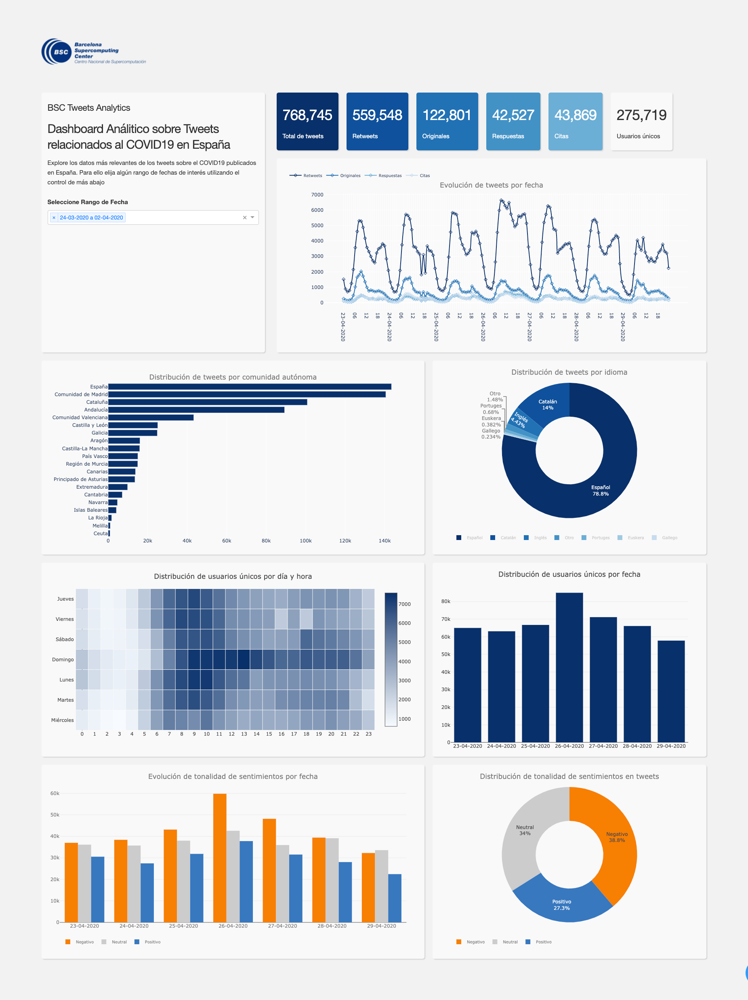

# Data pipeline to collect, process, analyze tweets about COVID-19

The repository contains scripts and software modules used to collect, process,
and analyze tweets about COVID-19. A MongoDB database is employed to store the
downloaded and processed data. The script **`tweets_processor.sh`** is 
responsible for the heavy-load of processing tasks. It computes the type,
extracts the complete text, identifies the location, calculates the sentiment, 
infers the language, and computes metrics (retweets, favorites) of tweets. The script
also updates the collection of users.

The directory **`data`** contains some datasets that help in processing tweets. For
example, the dataset **`banned_accounts.csv`** includes a list of Twitter accounts that
we decided to exclude from our tweets' collection. The datasets **`demonyms_spain.csv`** and
**`places_spain*.*`** are used to identify tweets' location. The dataset 
**`keywords_covid.txt`** holds the list of keywords we used to find tweets. The
datasets **`query_version_history.txt`** and **`query_versions.csv`** show the different 
queries we employed in our searches on Twitter. In these files, all versions of 
queries are reported together with usage start and end dates.

The directory **`legacy`** includes scripts and software code used in the past 
and are made available if they can be useful in the future.

The infrastructure's core is in **`src`**, which is organized in three main modules,
**`data_loader.py`**, **`data_explorter.py`**, and **`data_wrangler.py`** to load, export, and
process data, respectively. Functions implemented in these modules are expected to be
called from the script **`run.py`**, the main script to run processing and analysis.
Complementary, the directory **`utils`** contains utilitarian classes that are key in
executing the loading, exporting, and processing tasks. Next, the complete
structure of the directory is presented.

## Source code structure

```
...
├── src                                 <- Source code of the infrastructure
│   ├── __init__.py                     <- Makes src a Python module
│   ├── run.py                          <- Main script to run processing and analysis
|   |── test.py                         <- Script with testcases to evalute code
|   |── report_generator.py             <- Analysis function used in reporting
|   |── network_analysis.py             <- Class used to conduct network analysis
|   |── config.json.example             <- Example of a configuration file
│   ├── utils
│   │   └── __init__.py                 <- Makes utils a Python module
│   │   └── db_manager.py               <- Class to operate the MongoDB database
│   │   └── demographic_detector.py     <- Class to infer demographich features of users
│   │   └── embedding_trainer.py        <- Class to train word-embeddings from a corpus of tweets
│   │   └── figure_maker.py             <- Class to plot figures
│   │   └── language_detector.py        <- Class to detect language of tweets
│   │   └── location_detector.py        <- Class to detect location of tweets or users
│   │   └── sentiment_analyzer.py       <- Class to compute polarity score of tweets
│   │   └── utils.py                    <- General utilitarian
│   │   └── lib                         
│   │       └── dependency.txt          <- Instructions to download dependency of fasttext
│   │       └── lid.176.bin             <- Dependency binary of fasttext
│   │   └── dashboard                         
│   │       └── app.py                  <- Proof-of-concept of an interactive dashboard
│   │       └── assets                  <- Directory with the assets required by the dashboard 
...
```

## Demographic detector (M3Inference)

The demographic characteristics of users are calculated using the library 
[M3Inference](https://github.com/euagendas/m3inference), a deep-learning system 
for demographic inference. Details on how M3Inference works under the hood can
be learned in the article 
[Demographic Inference and Representative Population Estimates from Multilingual Social Media Data](https://dl.acm.org/doi/10.1145/3308558.3313684).

M3Inference helps us infer users' gender and age and identify which user 
accounts are controlled by organizations and which by "people." A posterior manual 
inspection on a representative sample of the M3Inference results showed a low 
accuracy of age inferences, hence, only gender and type of account 
(organization/non-organization) are considered for the analyses.

## Sentiment analyzer

The pipeline supports the sentiment analysis of tweets in Spanish, Catalan,
Vasque, Galician, and English. For Catalan, Vasque, and Galician, [Polyglot](https://pypi.org/project/polyglot), 
a python multilingual toolkit for natural language processing, is used. Polyglot
returns scores between 0 (most positive) and -1 (most negative) that are then
normalized using the (Hyperbolic Tangent function [TanH](https://en.wikipedia.org/wiki/Hyperbolic_functions#Hyperbolic_tangent) 
to have scores in the range of -1 - 1. 

For English, [Vader](https://pypi.org/project/vaderSentiment), a rule-based sentiment 
analysis tool, is applied together with Polyglot. TanH is also used here to 
normalize the scores of both tools, which are then averaged.

In the case of the Spanish tweets, a combination of three tools are employed. Apart 
from Polyglot, a customized version of [Affin](https://github.com/mmaguero/afinn) 
and the machine-learning-based solution [Senti-Py](https://github.com/aylliote/senti-py) 
are employed. As in the English case, the resulting scores are normalized using 
TanH and then averaged.

## Language detector

Even when the API of Twitter provides information about the language of tweets, 
we saw certain inaccuracy in this information. Tweets in Catalan are identified 
as French, tweets in Galician are reported as Portuguese, etc. So, we decided to 
run language detector tools on all tweets as part of the processing task.

Three tools are used for this purpose, namely Polyglot, [FastText](https://fasttext.cc/docs/en/language-identification.html), 
and [LangId](https://pypi.org/project/langid/1.1.5). The majority vote is applied 
to decide among the results of the three tools. Meaning, the language of tweets 
is determined by the language detected by the majority of the tools. If there 
isn't a clear candidate (i.e., all tools detect different languages), `undefined` 
is answered.

## Location detector

A multi-criteria approach has been implemented to detect the location of tweets. 
First, a data model has been developed to store information about cities, provinces, 
and autonomous communities in Spain. In the model, each city, province, autonomous 
community, country of interest has the following properties.

| Property | Type | Description | Valid values | Example |
|-|-|-|-|-|
| name | String | Name of the city/province/autonomous community/country | List of strings | España |
| alternative_names | List | Alternative names given to the city/province/autonomous community/country | List of strings | ['Spain', 'Spagna', 'Espanya'] |
| type | String | Type of place  | City, Province, Autonomous Community, Country | Country |
| flag_emoji_code | List | Emoji code of the place's flag | List of emoji codes in Github version | [':Spain:'] |
| languages | List | Languages spoken in the place | List of strings | ['es', 'ca', 'gl', 'eu'] |
| homonymous | Integer | Whether there is a homonymous place somewhere | 1 (there is a homonymous) / 0 | 0 |
| demonyms | Complex | Demonyms associated to the place |  |  |
| demonyms.names | List | Names of the demonyms | List of strings | ['Español', 'Española'] |
| demonyms.banned_prefix | List | Demonyms preceded by these terms are ignored | List of strings | ['en', 'hablo', 'es', 'lo'] |
| demonyms.banned_places | List | Demonyms are ignored if places listed here appear in location | List of strings | ['San Juan', 'Nuevo León'] |

An additional property is used to create hierarchical relationships between places. 
Places of `type` country contain a list of their regions, which at the same time 
include a list of their provinces. Provinces contain a list of their cities and 
so on. Following the example of the table, the place *España* has the property *regions*, 
which contains the Spain's regions. See **`data/places_esp.json`** for an example 
of how cities, provinces, and regions of Spain are defined using the data model.

### Criteria

1. **Matching place name**: the location self-declared by the user is inspected 
term by terms trying to find the name of a place included in the data model. If 
the located place has a homonymous somewhere, the name of the corresponding country, 
region, or province should also appear in the self-declared location. To favor 
inclusion over exclusion, an exception to this rule are locations that contain 
a unique string with the name of the place. For example, the city Cordoba exists 
in Spain and Argentina, so if a user declares `location=Cordoba` or 
`location=Cordoba, Andalucia`, they are both valid matches while 
`location=Soy de Cordoba` no.

2. **Matching demonyms in description**: the users' description is analyzed term 
by term, trying to find a match with the demonyms defined in the data model. Here, 
demonyms preceded by the terms included in the list of `banned_prefix` are ignored. 
Likewise, if there is a match with some of the defined demonyms but the user 
declares that she is located in one of the places listed in `banned_places`, the 
match is discarded.

3. **Language of description**: tweets (and their corresponding users) are assigned
to places according to the language of the users' descriptions. For example, tweets 
authored by users with descriptions written in Vasque are assigned to Vasque Country.

4. **Matching emoji flags**: location is inspected attempting to find the defined
emojis.

### Algorithm

Criterion `1)` is executed first; if the place could not be found, the criterion 
`2)` is applied. If criteria `1)` and `2)` did not match, criteria `3)` and `4)` 
are executed in this order. If non of the criteria produce a match, the tweet 
(and its corresponding) author are assigned to an `unknown` place.

### Evaluation

The approach has been tested using the test set `data/location_detector_testset.csv` 
and showed an overall `accuracy` of **0.968**, a `recall` of **0.983**, 
a `precision` of **0.981**, and `F1` of **0.982**. The table below shows the 
evaluation of each of the criteria.


| Criterion | Accuracy | Recall | Precision | F1 |
|-|-|-|-|-|
| Matching place name | 0.982 | 0.981 | 0.995 | 0.993 |
| Matching demonyms in description | 0.920 | 0.994 | 0.922 | 0.957 |
| Language of description | 0.834 | 0.861 | 0.975 | 0.911 |
| Matching emoji flags | 0.991 | 0.995 | 0.995 | 0.995 |

## Dashboard

A proof-of-concept dashboard can be launched by running `python app.py` from
`src/dashboard`



## Installation

1. Install requirements `pip install -r requirements.txt`
2. Rename `src/config.json.example` to `src/config.json` 
3. Set information about mongo db in `src/config.json`

## Command Line Interface (CLI)

The list of supported commands are in `src/run.py` and all commands must be run 
from the `src` directory. Some illustrative examples are presented below.

### Example 1: Identify location

`python run.py add-location-flags [mongo_collection_name] --config_file [mongo_config_file_name]`

### Example 2: Detect language

`python run.py add-language-flag [mongo_collection_name] --config_file [mongo_config_file_name]`

### Example 3: Analyze sentiment 

`python run.py sentiment_analysis [mongo_collection_name] --config_file [mongo_config_file_name]`

## Technology

1. [Python 3.6](https://www.python.org/downloads)
2. [MongoDB Community Edition](https://www.mongodb.com/download-center#community)--used as data storage repository

## Contributors

[Jorge Saldivar](https://github.com/joausaga), Nataly Buslón, and María José Rementería


